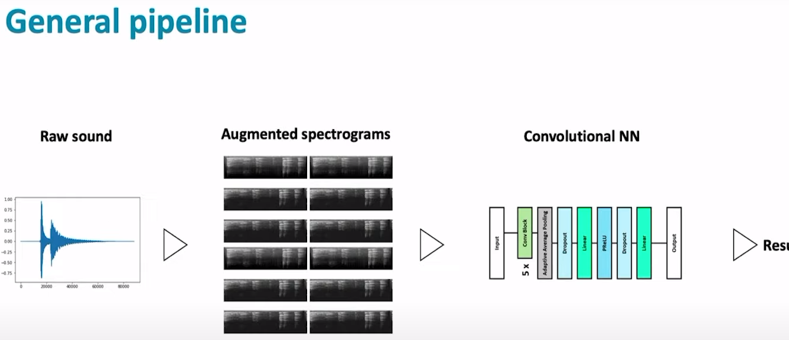
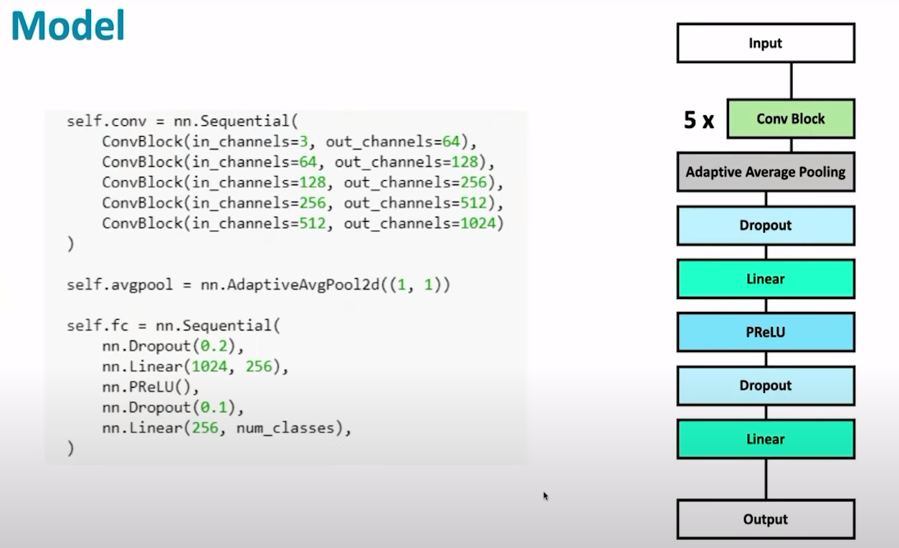
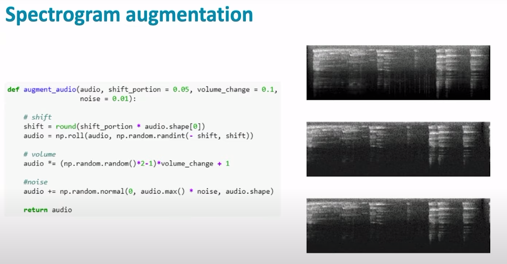
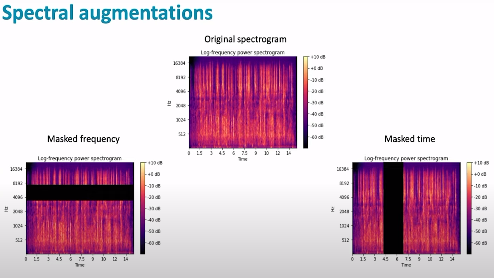
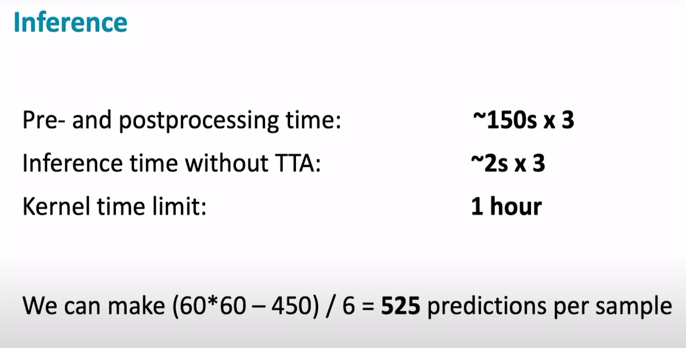
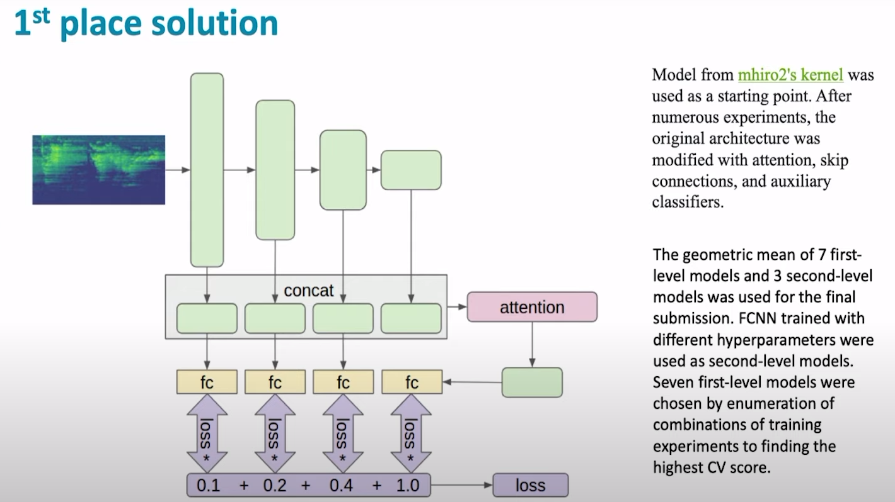
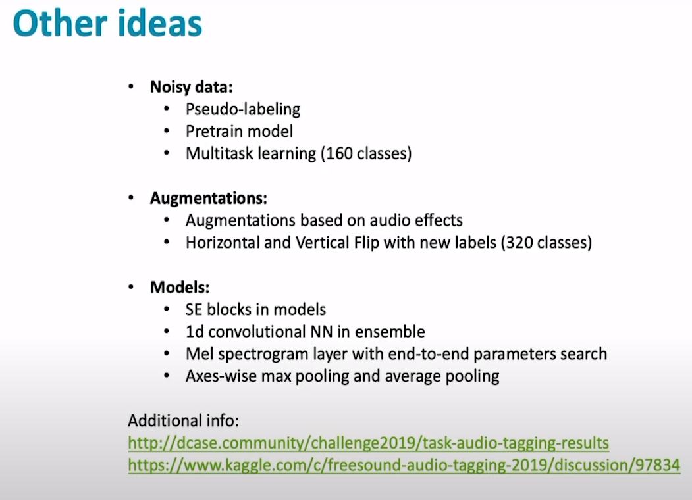

## Start  
- Beginner's Guide to Audio Data 2 [[notebook]](https://www.kaggle.com/maxwell110/beginner-s-guide-to-audio-data-2)  
- DSP Background - Deep Learning for Audio Classification p.1 [[youtube]](https://www.youtube.com/watch?v=Z7YM-HAz-IY)
- Loading Data - Deep Learning for Audio Classification p.2 [[youtube]](https://www.youtube.com/watch?v=-GddLd2_0ok&list=TLPQMTQwNDIwMjDi-b1159NkNQ&index=2)  

## Top Solutions  
### 1st place solution released on a Github  
[[discussion]](https://www.kaggle.com/c/freesound-audio-tagging-2019/discussion/95924)  

### 2nd place Solution  
[[discussion]](https://www.kaggle.com/c/freesound-audio-tagging-2019/discussion/97815)

### 3rd place solution  
[[discussion]](https://www.kaggle.com/c/freesound-audio-tagging-2019/discussion/97926)  

### Video of the 18th place solution and general discussion of the competition 
[[discussion]](https://www.kaggle.com/c/freesound-audio-tagging-2019/discussion/105826)

#### 比赛介绍  

#### 实验Pipeline

- Log-scaled Mel-spectrograms  
librosa

#### Model  
- Conv Block  

- Augmentation  

- mixup  

- cutout

- spectual augmentations 

#### Inference  

#### final pipeline  

#### 1st solution
- log-scaled mel-spectrograms
- CNN models with attention , skip connection and auxiliary classifiers 
- SpecAugment, Mixup augmentations 
- Hand Relabeling of the curated dataset samples with a low score  
- Ensembling with an MLP second-level model and geometric mean blending

## Useful Notebooks  
- CNN 2D Basic Solution Powered by fast.ai [[notebook]](https://www.kaggle.com/daisukelab/cnn-2d-basic-solution-powered-by-fast-ai) 
- Code to create FAT2019 Preprocessed Mel-spectrogram Dataset [[notebook]](https://www.kaggle.com/daisukelab/creating-fat2019-preprocessed-data)  
- Audio representation - what it's all about [[notebook]](https://www.kaggle.com/davids1992/audio-representation-what-it-s-all-about)   

## Useful Discussion
- [ ] Some ideas for making use of noisy data [[discussion]](https://www.kaggle.com/c/freesound-audio-tagging-2019/discussion/90757)
- [ ] gold solutions [[discussion]](https://www.kaggle.com/c/freesound-audio-tagging-2019/discussion/97834)

